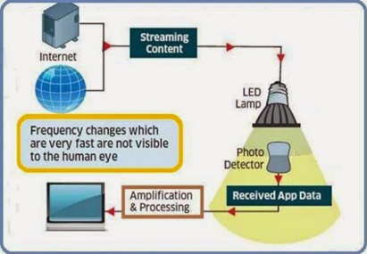
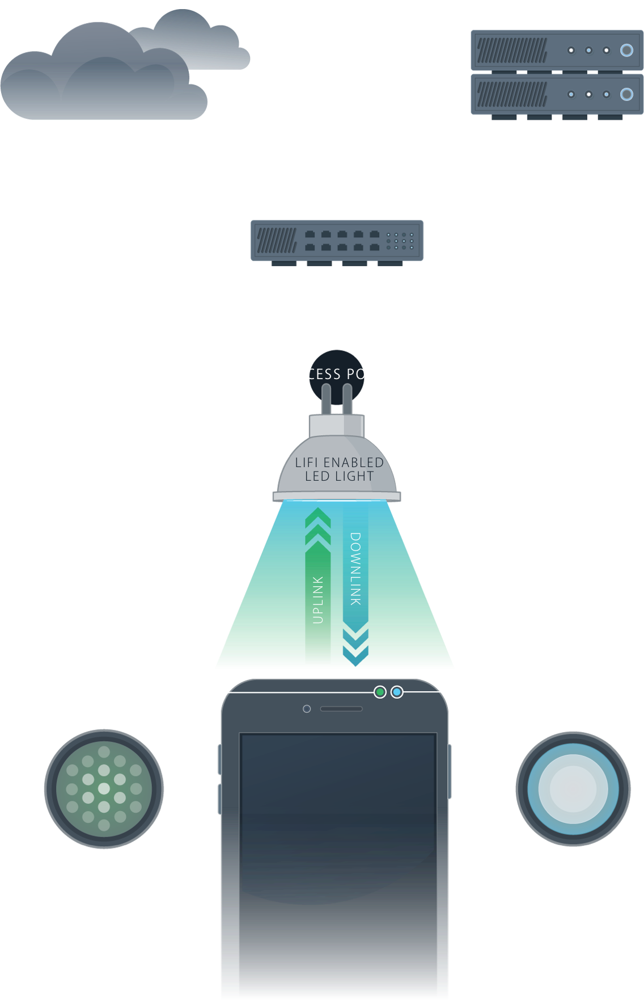
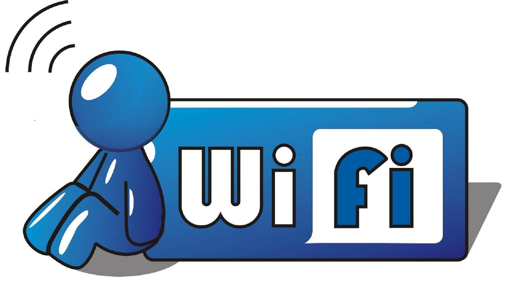

# LiFi (Light Fidelity): Pengertian, Perkembangan, Cara Kerja, dan Kelebihan
November-11-2020 Oleh M. KHAIRUL IKHSAN 

 
Inovasi di dunia hingga saat ini terus dikembangkan dan di setiap tahunnya ada kemungkinan penambahan teknologi baru. Salah satu teknologi yang berkembang hingga saat ini adalah internet yang memberikan berbagai macam informasi. Saat ini pula telah berkembang teknologi yang perannya untuk menunjang berjalannya internet. Teknologi tersebut bernama LiFi.

Ayo teman" simak terus artikel yang saya buat ini untuk terus menambah wawasan dan pengetahuan tentang LiFi :).

## Teknologi LiFi dapat menggantikan WiFi
## 1. Pengertian LiFi
LiFi adalah salah satu teknologi nirkabel yang memiliki fungsi tidak jauh berbeda dengan WiFi yaitu teknologi nirkabel dua arah dengan kecepatan tinggi.

 
Definisi LiFi (Light Fidelity) merupakan sistem pada teknologi komunikasi nirkabel dua arah yang memiliki kecepatan 100 kali lebih cepat dibandingkan dengan WiFi.

Teknologi komunikasi nirkabel ini ditemukan pertama kali dari hasil percobaan yang dilakukan oleh University College dan University Oxford dengan menggunakan media cahaya untuk mentransfer data dengan kecepatan yang tinggi (kurang lebih 100 Gbps per detik).

Perbedaannya dengan Wifi adalah teknologi ini tidak menggunakan frekuensi radio konvensional, tetapi menggunakan gelombang cahaya.

 
## 2. Perkembangan
Perkembangan teknologi komunikasi beberapa tahun ini telah mengalami peningkatan, salah satunya teknologi LiFi.

LiFi (Light Fidelity) adalah media transmisi data dengan koneksi berbasis cahaya dengan hasil uji lab dapat mengantarkan informasi sebanyak 224 GB/detik atau sebanding dengan mengirimkan 18 film yang memiliki masing-masing ukuran 1.5 GB dalam kurun waktu satu detik saja.

Perkembangan LiFi hingga saat ini masih terdapat beberapa hambatan, salah satunya sinyal yang dimiliki teknologi ini tidak dapat menembus tembok ataupun area yang memiliki penghalang.

Seiring dengan tingginya pertumbuhan pasar pada perangkat sensor dan loT, maka semakin tinggin pula data transmisi yang diperlukan.

Namun, hingga saat ini infrastruktur yang dimiliki belum dapat handling kuantitas data yang diperlukan untuk transmisi di perangkat loT.

Light Fidelity mungkin dapat menjadi solusi apabila pengguna dan perancang telah menginginkan pertumbuhan kontinyu pada loT dan Big Data.

Perusahaan pencetus Light Fidelity yang bernama pureLiFi telah memunculkan sistem plug-and-play pada sistem teknologi ini dengan kapasistas 115 MB/detik.

Proyek lain yang dimilikinya masih dalam tahap pengembangan dan uji coba pada rumah sakit dan perkantoran di beberapa daerah di dunia.

## 3. Cara Kerja LiFi
Cara kerja teknologi ini adalah menggunakan sumber cahaya yang cukup seperti LED (Light Emitting Diodes) ataupun Light Sensor, kemudian ujung perangkat lain akan melakukan deteksi serta mengartikannya sebagai biner yang sama kemudian akan dapat dibaca oleh komputer.

 artinya, teknologi ini dapat bekerja apabila masing-masing perangkat yang dimiliki dapat terhubung dan saling berpasangan untuk melakukan kegiatan seperti menstransmisikan data.

Contoh sederhana kerja Light Fidelity yang dapat kita rasakan saat ini adalah cahaya yang terdapat pada remote TV (cahaya infra-merah) yang mampu melakukan transmisi data lebih dari 1000 bps.

Sedangkan lampu LED (Light Emitting Diodes) yang digunakan saat ini telah mengalami perkembangan dengan kemampuan transmisi data yang stabil dan terlihat seperti cahaya lampu pada umumnya.

## 4. Perbedaan LiFi dan WiFi

LiFi dan WiFi merupakan dua teknologi nirkabel (tanpa kabel) dua arah yang memiliki kecepatan tinggi.

Namun keduanya memiliki perbedaan pada media penghantarnya yaitu berupa gelombang cahaya dan gelombang radio.

WiFi merupakan pemancar jaringan internet melalui gelombang radio, namun LiFi menggunakan gelombang cahaya untuk media transmisinya.

Teknologi yang dimiliki oleh WiFi memiliki kecepatan yang lebih rendah dibandingkan dengan Light Fidelity karena kecepatan gelombang cahaya lebih cepat 10.000 kali dibandingkan dengan gelombang radio.

Namun dibalik itu, apabila ia tidak terdapat cahaya yang optimal maka tidak dapat digunakan dan lebih baik menggunakan WFi dengan gelombang radionya.

Selain itu, perbedaan dari keduanya adalah mengenai biaya yang diperlukan untuk menggunakan teknologi tersebut.

Instalasi WiFi memerlukan biaya yang lebih rendah dibandingkan dengan Light Fidelity.

## 5. Kelebihan LiFi
Berdasarkan uraian di atas mengenai teknologi ini, tentu saja teknologi ini memiliki beberapa kelebihan bagi siapa saja yang menggunakan jasanya.

### 5.1 Kecepatan Akses
Akses internet dengan menggunakan Light Fidelity dapat menjadi lebih cepat dari media transmisi lainnya, dengan kecepatan transfer mencapai 100 GBps.

### 5.2 Lebih Aman
Teknologi ini merupakan teknologi yang lebih aman dibandingkan dengan teknologi lain.Hal ini dikarenakan data tidak terganggu bila tidak ada cahaya yang tertangkap dan lebih efektif di gunakan dalam pesawat yang tidak boleh adanya gelombang radio.

### 5.3 Tidak Terjadi Interferensi Gelombang
Kelebihan lainnya dari teknologi ini adalah tidak adanya interference antara jaringan seperti halnya yang terjadi pada jaringan WiFi.

### 5.4 Menerangi Ruangan
Selain itu, teknologi ini juga memiliki kegunaan ganda untuk mentransmisikan data dan menerangi ruangan.

 
Karena menggunakan bantuan cahaya, teknologi ini dianggap sebagai teknologi yang dapat mengurangi polusi elektromagnetik dengan tingkat keamanan terjaga secara maksimal.

### 6. Kekurangan LiFi
Meskipun begitu banyaknya kelebihan yang dimiliki teknologi ini, Lifi juga memiliki beberapa kekurangan.

### 6.1 Kurangnya Mobilitas
Light Fidelity merupakan teknologi yang tidak bisa dipindah-pindah, maka dengan hal ini koneksi menggunakan WiFi masih sangat diperlukan.

 
### 6.2 Cakupan Jaringan yang Sempit
Selain itu, area cakupan LiFi pendek dan membutuhkan direct line of sight atau biasa disebut dengan pandangan langsung antara pemancar sinyal dan gadget tujuan.

### 6.3 Tidak Bisa Menembus Dinding
Berbeda dengan teknologi yang menggunakan gelombang radio, Light Fidelity memiliki sinyal yang sulit menembus tembok sehingga teknologi ini tidak dapat digunakan apabila kita berada di ruangan yang berbeda dengan alat pemancar sinyal Lifi.

Pasalnya juga, ia hanya dapat digunakan langsung di bawah cahaya dan tidak bisa diakses ketika tidak ada cahaya.

Kecuali dengan penyinaran menggunakan sinar matahari.

Sinar ini nantinya hanya akan mengganggu cahaya buatan yang digunakan dalam kegiatan mentransmisikan koneksi.

### 6.4 Memerlukan Sumber Cahaya Optimal
Tantangan lain Light Fidelity adalah koneksi teknologi ini harus menggunakan sumber cahaya yang sempurna agar dapat mentransmisikan data secara optimal.

### 7. Kapan LiFi Tersedia?
Perkembangan terhadap Light Fidelity hingga saat ini tidak hanya dalam bentuk prototipe.

Walaupun belum banyak digunakan, sejumlah perusahaan telah mengembangkan dan siap menguji produk yang telah dibuatnya di lapangan.

Salah satunya adalah perusahaan asal India yang bergerak di bidang startup, Velmeni.

Perusahaan ini tengah menguji bohlam Light Fidelity yang dibuatnya dan diperuntukkan di area industri hingga perkantoran.

Namun sebelum itu, maskapai Air France telah menggunakan teknologi tersebut di dalam pesawat.

LiFi yang berada di dalam pesawat maskapai ini disediakan oleh perusahaan asal Prancis yaitu Oledcomm.

Pemasangan teknologi ini hanya berada pada pesawat yang memiliki ukuran sedang dengan menjanjikan kecepatan hingga 100 MBps.

 

Meskipun saat ini teknologi Lifi masih jarang ditemukan dan masih dikembangkan, tetapi teknologi ini menjanjikan masa depan transfer data melalui cahaya yang tentunya akan lebih cepat dibandingkan menggunakan gelombang radio.

Apabila kabel konvensional sudah tergantikan dengan fiber optik, kini saatnya jaringan nirkabel radio dapat digantikan dengan teknologi Light Fidelity.

Okee teman" terima kasih telah membaca artikel ini semoga dapat menambah wawasan dan pengetahuan kita ya :))

Sumber : 
https://tekno.foresteract.com/lifi/        
https://ee.uii.ac.id/2020/06/01/mengenal-teknologi-li-fi-light-fidelity/
https://kontakt.io/blog/li-fi-technology-addition-wi-fi-ble/
https://whatis.techtarget.com/definition/LiFi
https://cacm.acm.org/news/239145-lifi-standard-signals-a-light-bulb-moment-for-the-internet/fulltext
